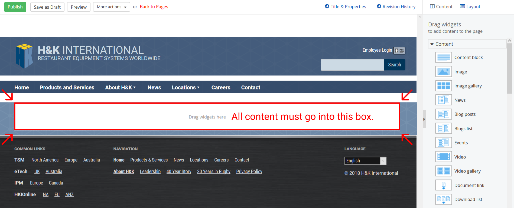

# Setting up a new page on test.hki.com

## Create the page

Visit http://test.hki.com/Sitefinity/Pages?lang=en and click "Create a Page". (If you're creating a page inside a group, find the "Group page" for that group, click the Actions dropdown to the right of it, and click "Create a child page".)

Type in a name for the page. The HKI Glass template should be selected by default. Click "Create and go to add content" at the bottom of the page.

## Lay out the page

Now you need to arrange the content blocks that will hold your text. To match the company style, your blocks need to be inside the container our theme provides:

Drag a content block from the "Drag widgets" column on the right into the "Drag widgets here" area in the center of the page. When placing your content blocks, *be sure that they have the blue margins to their left and right, and they don't run to the edges of the page!* If your content block doesn't have the blue margin visible on either side, drag the gray bar above it until it fits.

If you want multiple columns, go into Layout mode (top-right corner), pick a columns layout from "Single and Two Columns", and drag it into the content zone from the picture above. Just as with content blocks, make sure your layout has blue margins to its left and right. When your columns are all set up, switch back to Content mode (top-right corner) and drag content blocks into the layout.

## Add content

Click the "Edit" button on a content block (or "Enter content") and type in some content. You can use the formatting controls at the top of the editor to add bolding, links, images, and so forth.

## Adjust blocks with CSS classes

You may need to add CSS classes to the widgets to get them to look the way you want. To add a class, edit the widget, click "Advanced", and scroll down until you find the "CssClass" box. Add the class you want to the box, with a space between classes, like this:

> class1 class2

The classes included in our theme are as follows:

- `no-margin-top`, `no-margin-bottom`: Widgets normally have margins, which create space between them. Use these classes to remove the margins above or below the widget. (Since each widget usually has a margin above and a margin below it, if you you want to completely eliminate the gap between widgets, you'll need to apply `no-margin-top` to one and `no-margin-bottom` to the other.)
- `no-padding-top`, `no-padding-bottom`: Same as above, but with padding (inside the box) instead of margins (outside the box). More info: [The box model](https://developer.mozilla.org/en-US/docs/Learn/CSS/Introduction_to_CSS/Box_model)
- `denest-list`: Makes the top level of a list not look like a list item. (Useful when the top level of the list is the list's title.)

## Finishing up

Near the upper left corner there's a "Preview" button you can click to see what the page will look like without the page-building interface. When you're finished building the page, click the green "Publish" button. This will return you to the Pages screen, where you can click "View" to see your finished page.
